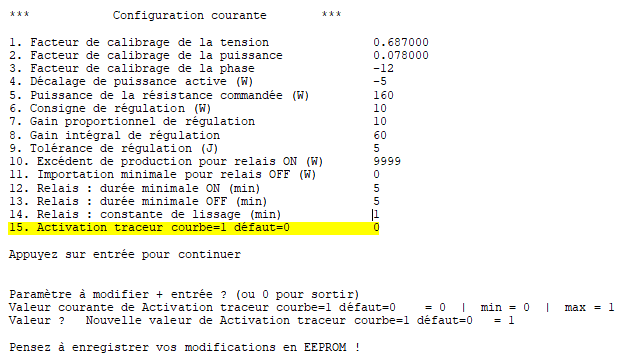

## Nouvelle fonction : Traceur courbes sur Arduino IDE

Le but de ce "MOD" est d'ajouter une fonctionnalité permettant d'avoir une visualisation graphique des principales valeurs importantes du routeur EcoPV. 
Il est ainsi plus simple de visualiser l'évolution de la puissance mesurée, le retard de déclenchement  du relais statiques, ainsi que la puissance routée.

Pour activer cette nouvelle fonction (15) , une nouvelle variable a été ajoutée dans le menu configuration :

Par défaut l'affichage des statistiques classiques reste activé (valeur = 0), pour sérialiser les données et les rendre compatible avec le traceur série de l’Arduino IDE , il faut positionner cette valeur a 1.
Après le redémarrage du routeur, grâce au câble USB et de l'outil -> traceur série, vous pourrez visualiser ces courbes.

*Ps1 : l’intervalle de temps entre chaque échantillons peut être modifié dans le code source en modifiant : #define NB_CPTPERIODES   5 (exemple: 5 x 20ms = toutes les 100 ms )

*Ps2 : il peut être nécessaire de formater l'EEPROM pour obtenir cette nouvelle fonctionnalité. Dans ce cas n'oubliez pas de noter vos paramètres avec l'option 11 du menu.*

StephF13 , 25 Avril 2020
