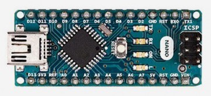
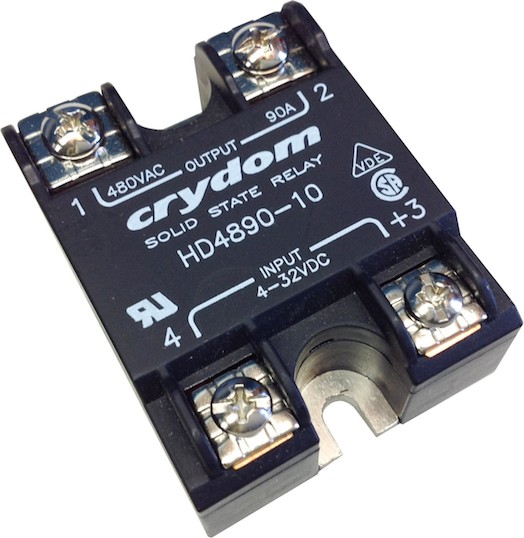
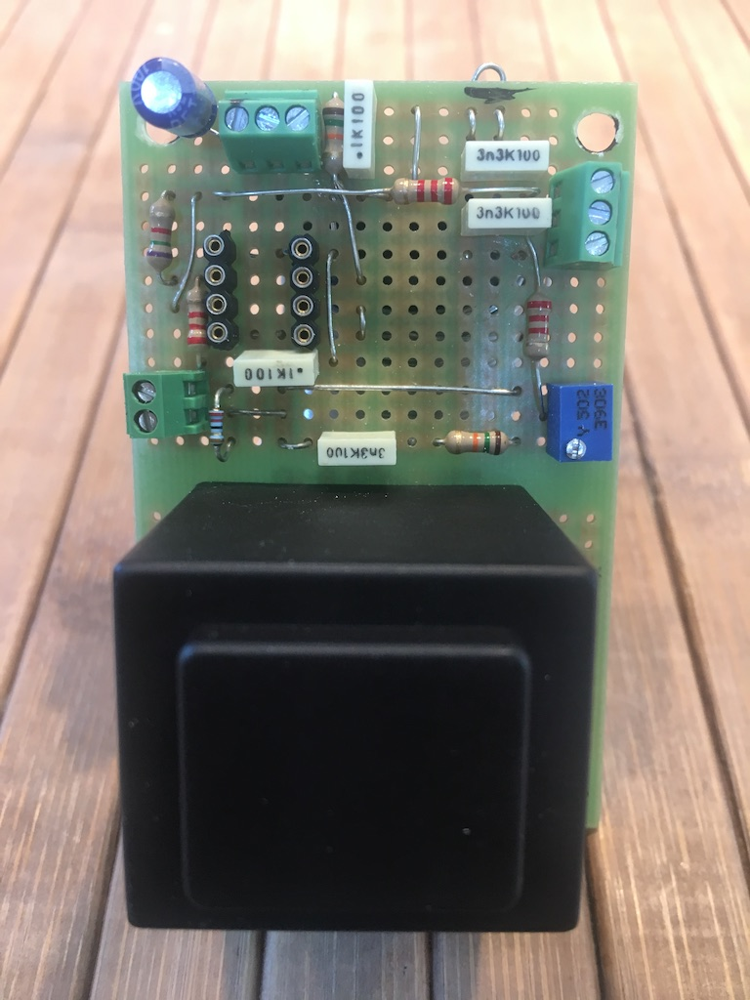
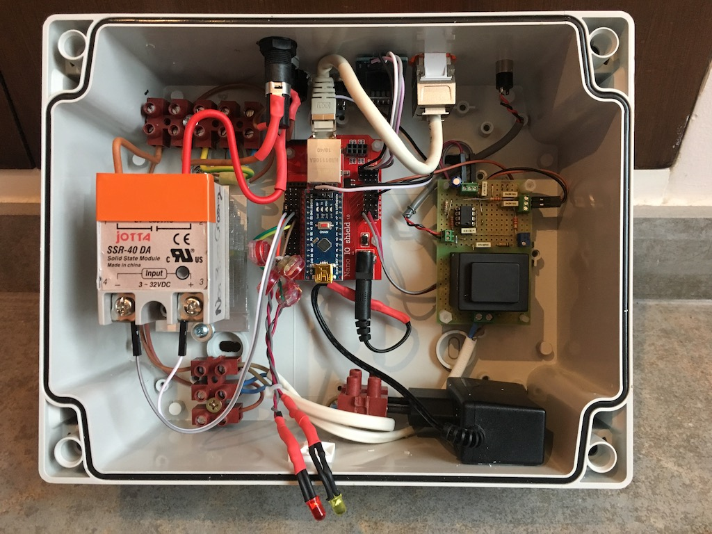

# EcoPV
EcoPV is a Arduino program (ATMega328P) that maximizes the use of PV production by monitoring home energy consumption and by diverting power to a resistive charge when needed.  
 
EcoPV est un programme pour Arduino (ATMega328P) qui permet de gérer l'excédent de production photovoltaïque dans une installation d'autoconsommation en effectuant un routage de l'excédent vers une charge résistive, typiquement la résistance d'un chauffe-eau électrique. Ainsi l'autoconsommation est optimisée.  
EcoPV est inspiré de réalisations précédentes dont des références sont données en fin de document.  

## Mise en garde  
Les programmes et les schémas proposés ont une vocation informative et pédagogique. Ils ont été testés avec succès par les auteurs. Cependant les auteurs de ces programmes et de ces schémas déclinent toute responsabilité. Les auteurs ne pourraient être tenus pour responsables du fonctionnement et des conséquences de l'utilisation des programmes et des schémas mis à disposition.  
Intervenir sur des circuits électriques est dangereux et nécessite le recours à une personne qualifiée et le respect strict des normes de sécurité et de protection en vigueur.

## Fonctionnement  
EcoPV mesure en permanence la puissance consommée par la maison. Lorsque la production photovoltaïque dépasse la consommation, cela est immédiatement détecté par EcoPV. EcoPV pilote alors un variateur électronique qui va alimenter finement une résistance électrique (chauffe-eau) pour équilibrer puissance consommée et puissance produite. Ainsi, l'excédent de production photovoltaïque est dirigé vers la résistance du chauffe-eau et valorisé en chaleur au lieu d'être cédé au réseau électrique extérieur.  
  
Techniquement, EcoPV est basé sur :  
* un échantillonnage rapide de la puissance consommée (8300 fois par seconde),  
* une régulation proportionnelle-intégrale de la charge résistive,  
* une programmation du régulateur entièrement gérée par les interruptions de l'ATMega328.  
  
## Specifications de EcoPV  
* Mesure de la puissance consommée 8300 fois par seconde.  
* Régulation proportionnelle intégrale calculée toutes les 10 ms pour le pilotage de la charge résistive.  
* Calcul de Vrms, Irms, Pactive, Papparente, cos phi, Proutée, énergie importée, énergie exportée, énergie routée.  
* Relais secondaire optionnel à activation/désactivation sur seuils paramétrables.  
* Interface utilisateur interactive sur terminal par liaison série pour :  
  * Affichage des statistiques de fonctionnement toutes les secondes,  
  * Paramétrage et calibrage du système.  
* Sauvegarde des paramètres et des compteurs d'énergie en mémoire non volatile (EEPROM).  
* Horloge et scheduler internes pour la programmation de tâches planifiées.   
* Communication MYSENSORS optionnelle (option de compilation).  
* Communication ETHERNET optionnelle (option de compilation). API HTTP de récupération des données.  
* Auto-contrôle du fonctionnement et visualisation du statut par mot d'état.
  
## La partie matérielle  
EcoPV nécessite plusieurs choses pour fonctionner :  
* **Une carte Arduino** basée sur un ATMega 328 5V 16 MHz de type Arduino Nano. C'est le coeur du système qui exécute le programme EcoPV.ino.  
  
* **Un circuit de mesure de la tension et du courant consommé par la maison** :  
  
C'est un circuit électronique analogique qui convertit la tension et le courant dans des valeurs acceptables par l'Arduino. Il utilise un transformateur pour mesurer la tension du secteur et une pince ampérémétrique pour mesurer le courant. Celle-ci devra être placée au niveau du fil de phase qui alimente la maison en aval du disjoncteur principal. Un transformateur Hahn BVEI3063359 et une pince ampéremétrique YHDC SCT-013-000 ont été employés pour le montage et donnent des résultats très satisfaisants.  
* **Un relais électronique SSR (Solid State Relay)** de type *non zero crossing* capable d'être piloté par une tension de 5V. Ce relais électronique commandera la résistance électrique (chauffe-eau).  
  
  
  
De manière optionnelle, EcoPV peut être équipé de :  
* **2 LEDs signalant le fonctionnement.**  
* **Un relais secondaire de délestage.** Il permet le pilotage d'un appareil électrique en "tout ou rien" en fonction de seuils paramétrables de mise en marche et d'arrêt.  
* **Un système de communication.** Les données sont alors transmises :
  * soit sans fil selon le protocole MYSENSORS, ce qui nécessite un module radio NRF24L01,
  * soit par câble ethernet grâce à une API HTTP, ce qui nécessite un shield ENC28J60 pour Arduino.  
  
Le schéma général de branchement est le suivant :  

  
## La programmation de l'Arduino  
EcoPV nécessite l'installation de l'IDE Arduino disponible sur le site Arduino. Voir www.arduino.cc  
Pour l'utilisation de la communication MYSENSORS, les bibliothèques correspondantes devront être installées. Voir www.mysensors.org  
Pour l'utilisation de la communication Ethernet, les 2 bibliothèques EtherShield et ETHER_28J60 devront être installées **manuellement**. Elles sont disponibles dans le répertoire libraries.  
  
Dans l'IDE de l'Arduino, ouvrir le programme EcoPV.ino.  
Choisir au début du code les options de compilation souhaitées.  
Compiler le programme et le télécharger dans la carte Arduino.  
Le programme démarrera automatiquement avec des paramètres par défaut.  
L'accès à l'interface utilisateur par liaison série se fait par défaut à la vitesse de 500 000 bauds. 
  
Voici un exemple d'écran disponible par le terminal série (d'autres exemples dans le répertoire screenshots) :  

*Note : en absence du circuit analogique fonctionnel, le programme ne détectera pas la synchronisation secteur et entrera dans un mode d'erreur.*  
  
## Exemple de réalisation pratique  

Voici la réalisation de la partie analogique sur une plaquette d'expérimentation. Le transformateur de tension occupe une place importante. Il est généreusement dimensionné pour être bien linéaire et améliorer l'acquisition de la tension :

Et l'ensemble du montage, incluant l'alimentation, l'Arduino Nano avec un shield ethernet, le SSR et son radiateur, les protection par fusible, un interrupteur, un bouton reset, les LEDs et également un circuit ESP8266 programmé pour faire le lien entre la liaosn série de l'Arduino et le wifi :

## Calibrage et paramétrage  
Pour un fonctionnement optimal, EcoPV nécessite le calibrage d'un certain nombre de paramètres en fonction de votre installation et des particularités des composants du circuit élecronique analogique. Ce calibrage des paramètres doit être fait une fois que votre réalisation est terminée, prête à être installée.

**Note 1 concernant le logiciel :** Le logiciel EcoPV est configuré avec des paramètres par défaut. A la première exécution du programme, ces paramètres par défaut seront stockés dans la mémoire non volatile de l'Arduino. Par la suite, l'ajustement des paramètres se réalise grâce à l'interface de configuration et leur sauvegarde s'effectue par l'option 13 du menu. Si vous souhaitez revenir aux paramètres par défaut, formatez l'EEPROM (option 82) et réalisez un reset matériel de l'Arduino en appuyant sur le bouton reset. EcoPV redémarrera alors avec les paramètres par défaut. 

**Note 2 concernant la pince ampéremétrique :** La pince ampéremétrique ou transformateur de courant se clipse autour du fil de phase. Lorsque la pince se referme, il est important que les 2 demi-tores de ferrite se positionnent correctement et soient bien alignés l'un vis-à-vis de l'autre. Un mauvais positionnement provoque une dégradation de la qualité de la mesure. 

* **Facteur de calibrage de la tension (V_CALIB).** Ce paramètre permet d'obtenir un affichage juste de la tension secteur (Vrms). Ce n'est pas un paramètre critique. Pour assurer un bon fonctionnement, il est recommandé de conserver la valeur par défaut (0.8) et d'ajuster le potentiomètre de la carte électronique pour mettre en accord la tension Vrms affichée et la tension du secteur réelle, mesurée à l'aide d'un voltmètre. Pour information, la valeur 230 V du secteur peut varier de +/- 10 %. 

* **Facteur de calibrage de la puissance (P_CALIB).** Ce paramètre permet d'obtenir un affichage juste des puissances. C'est un paramètre important à ajuster avec soin. Le calibrage va utiliser la lecture de votre compteur électrique EDF qui doit être de type électronique. Clipsez la pince ampéremétrique autour du fil de phase qui alimente votre maison juste en aval du disjonteur principal. Comparez la valeur Pappar donnée par EcoPV à la valeur de puissance en VA mesurée par votre compteur électrique. Si les valeurs différent, ajustez le paramètre P_CALIB pour que EcoPV donne une valeur de puissance identique à celle de votre compteur électrique à 10 VA près. Pour plus de précision, allumez quelques appareils électriques pour faire le réglage pour une puissance d'environ 2000 VA. P_CALIB devrait être de l'ordre de 0.1, et vous serez amené à régler la valeur à 3 chiffres après la virgule. Augmentez P_CALIB si EcoPV donne une valeur de Pappar en VA plus petites que celle du compteur, diminuez la dans le cas contraire. 

* **Facteur de calibrage de la phase (PHASE_CALIB).** Il s'agit du réglage le plus important à réaliser pour le bon fonctionnement de EcoPV ! Pour faire ce réglage, clipsez la pince ampéremétrique sur le fil de phase d'un appareil électrique constitué d'une résistance électrique pure : chauffe-eau, radiateur, bouilloire... d'une puissance comprise entre 1500 et 3000 W. Mettez en marche l'appareil. La valeur Pactive affiche alors la puissance active en W correspondant à la puissance de l'appareil. Le réglage de PHASE_CALIB consiste à maximiser la valeur de Cos phi, ce qui minimine Sin phi. Vous aurez plus de précision en utilisant Sin phi. Faites varier PHASE_CALIB en l'augmentant ou en le diminuant pour obtenir la plus petite valeur possible de Sin phi. Sin phi prendra une valeur très proche de 0. Ajustez PHASE_CALIB pour obtenir la plus petite valeur possible de sin phi à 3 chiffres après la virgule. Lorsque vous avez trouvé la valeur PHASE_CALIB qui donne une valeur de sin phi minimale, vous avez atteint le bon réglage. Dans ces conditions, Cos phi sera égal à 1 ou très proche de 1. 

* **Décalage de puissance active (W) (P_OFFSET).** C'est un réglage important qui permet d'éliminer les décalages résiduels dans la mesure de la puissance active Pactive. Relevez la puissance active Pactive mesurée sur une charge résistive pure (voir point précédent). Dé-clipsez la pince ampéremétrique, retournez là, et clipsez la à nouvau sur le fil de phase. Relevez la puissance active Pactive de nouveau. Si les 2 valeurs mesurées différent, modifiez le paramètre P_OFFSET. Recommencez la procédure jusqu'à trouver la valeur de P_OFFSET qui permet d'obtenir une valeur de Pactive identique à 5 W près quelque soit le sens de branchement de la pince ampéremétrique. Typiquement, P_OFFSET aura une valeur comprise entre -15 W et +15W. 

* **Puissance de la résistance commandée (W) (P_RESISTANCE).** Indiquez ici la puissance de la résistance électrique en Watts qui sera branchée et pilotée par EcoPV : chauffe-eau, radiateur électrique. Il est conseillé que la puissance de cette résistance soit légèrement supérieure au surplus maximal que pourrait générer votre installation photovoltaïque. 

* **Consigne de régulation (W) (P_MARGIN).** C'est la cible de puissance importée du réseau EDF que cherchera à atteindre la régulation EcoPV lorsque vous serez en situation de surplus de production photovoltaïque. Idéalement on aimerait pouvoir avoir 0 W, mais en pratique il est prudent de conserver une marge de sécurité. 15 W est une valeur standard qui fonctionnera bien si les étapes précédentes de calibrage ont été effectuées avec soin. **Note :** si vous êtes dans une situation d'autoconsommation avec vente du surplus, vous pouvez indiquez ici une valeur négative. Cette valeur négative correspondra à une valeur de surplus maximal en Watts que vous autorisez pour la vente. Exemple : si vous indiquez -500, cela voudra dire qu'au maximum 500 W de votre production sera destinée à la vente. 

* **Gain proportionnel de régulation (GAIN_P).** C'est un paramètre essentiel du régulateur EcoPV dont dépend la qualité de régulation. Il correspond au gain proportionnel du régulateur de EcoPV. C'est une valeur entière. Une valeur standard de GAIN_P se calcule ainsi : 150000 * P_CALIB / P_RESISTANCE. Typiquement GAIN_P = 5 pour une résistance de charge de 3000 W. 

* **Gain intégral de régulation (GAIN_P).** C'est un paramètre essentiel du régulateur EcoPV dont dépend la qualité de régulation. Il correspond au gain intégral du régulateur de EcoPV. C'est une valeur entière. Une valeur standard de GAIN_I se calcule ainsi : 900000 * P_CALIB / P_RESISTANCE. Typiquement GAIN_I = 30 pour une résistance de charge de 3000 W. 

* **Tolérance de régulation (J) (E_RESERVE).** C'est un paramètre du régulateur qui intervient lorsque le surplus de production est très faible. Valeur à indiquer : 5. 

* **Excédent de production pour relais ON (W) (P_DIV2_ACTIVE).** Ce réglage et les suivants ne sont nécessaires que si vous utilisez le relais secondaire de délestage. P_DIV2_ACTIVE correspond à la valeur en Watts du surplus de production photovoltaïque à partir duquel sera enclenchée la charge secondaire qui consommera votre surplus (pompe de piscine...). 

* **Importation minimale pour relais OFF (W) (P_DIV2_IDLE).** P_DIV2_IDLE correspond à la valeur de la puissance active importée du réseau EDF qui provoquera l'arrêt de la charge secondaire. **Note :** Afin que le pilotage de la charge secondaire de délestage soit stable, il faut respecter la condition : ( P_DIV2_ACTIVE + P_DIV2_IDLE ) supérieur à la valeur de la charge secondaire connectée en Watts. 

* **Relais : durée minimale ON (min) (T_DIV2_ON).** Durée minimale de fonctionnement de la charge secondaire en minutes une fois enclenchée. Il s'agit d'éviter des cycles marche/arrêt trop fréquents de la charge secondaire, en particulier s'il s'agit d'une pompe. Valeur typique : 5 minutes. 

* **Relais : durée minimale OFF (min) (T_DIV2_OFF).** Durée minimale de repos de la charge secondaire en minutes une fois stoppée. Il s'agit d'éviter des cycles marche/arrêt trop fréquents de la charge secondaire, en particulier s'il s'agit d'une pompe. Valeur typique : 5 minutes. 

* **Relais : constante de lissage (min) (T_DIV2_TC).** C'est un réglage qui permet de filtrer la valeur des puissances prises en compte pour le déclenchement ou l'arrêt de la charge secondaire. L'objectif est d'éviter la mise en route ou l'arrêt intempestif de la charge secondaire qui serait lié à une fluctuation transitoire de la production photovoltaïque ou de la consommation (passage nuageux, démarrage d'un réfrigérateur...). T_DIV2_TC est une constante de temps qui s'exprime en minutes. Valeur standard : 1 minute. Note : les valeurs filtrées de Pactive et Proutée sont indiquées sur l'affichage. 

**Note 3 : Sauvegarde des paramètres.** N'oubliez pas de sauvegarder les paramètres modifiés par l'option 13 du menu, sinon ils seront perdus au prochain démarrage. 

**Note 4 :** Certains paramètres nécessitent un redémarrage de EcoPV pour être définitivement pris en compte par toutes les fonctions du programme. Ce redémarrage s'effectue par l'option 99 du menu ou en provoquant un reset matériel du routeur. Les paramètres concernés sont : P_OFFSET, P_MARGIN et tous les paramètres relatifs au relais secondaire de délestage. 

## Sources et liens  
Forum photovoltaïque, travaux de tignous84 et rolrider - PV Routeur : https://forum-photovoltaique.fr/viewforum.php?f=110  
Site Openenergy monitor : https://openenergymonitor.org  
*A compléter...*  
  
