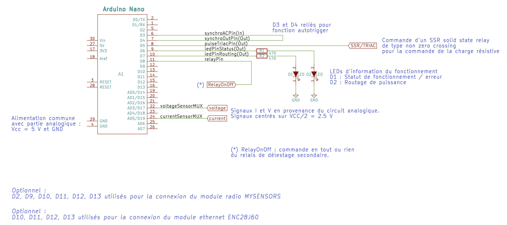
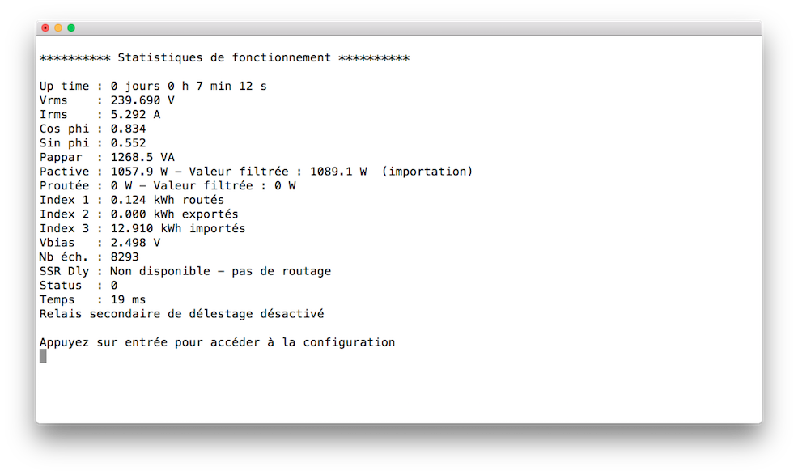

# EcoPV
EcoPV is a Arduino program (ATMega328P) that maximizes the use of PV production by monitoring home energy consumption and by diverting power to a resistive charge when needed.  
 
EcoPV est un programme pour Arduino (ATMega328P) qui permet de gérer l'excédent de production photovoltaïque dans une installation d'autoconsommation en effectuant un routage de l'excédent vers une charge résistive, typiquement la résistance d'un chauffe-eau électrique. Ainsi l'autoconsommation est optimisée.  
EcoPV est inspiré de réalisations précédentes dont des références sont données en fin de document.  

## Fonctionnement  
EcoPV mesure en permanence la puissance consommée par la maison. Lorsque la production photovoltaïque dépasse la consommation, cela est immédiatement détecté par EcoPV. EcoPV pilote alors un relais électronique qui va alimenter de manière variable une résistance électrique (chauffe-eau) pour équilibrer puissance consommée et puissance produite. Ainsi, l'excédent de production photovoltaïque est dirigé vers la résistance du chauffe-eau et valorisé en chaleur au lieu d'être cédé au réseau électrique extérieur.  
  
Techniquement, EcoPV est basé sur :  
* un échantillonnage rapide de la puissance consommée (8300 fois par seconde),  
* une régulation proportionnelle-intégrale de la charge résistive,  
* une programmation du régulateur entièrement gérée par les interruptions de l'ATMega328.  
  
## Mise en oeuvre  
EcoPV nécessite plusieurs choses pour fonctionner :  
* **Une carte Arduino** basée sur un ATMega 328 5V 16 MHz de type Arduino Nano. C'est le coeur du système qui exécute le programme EcoPV.ino  
* **Un circuit de mesure de la tension et du courant consommé par la maison** :  

C'est un circuit électronique analogique qui convertit la tension et le courant dans des valeurs acceptables par l'Arduino. Il utilise un transformateur pour mesurer la tension du secteur et une pince ampérémétrique pour mesurer le courant. Celle-ci devra être placée au niveau du fil de phase qui alimente la maison en aval du disjoncteur principal.  
* **Un relais électronique SSR (Solid State Relay)** de type *non zero crossing* capable d'être piloté par une tension de 5V. Ce relais électronique pilotera la résistance du chauffe-eau.  
  
De manière optionnelle, EcoPV peut être équipé de :  
* **2 LEDs signalant le fonctionnement,**  
* **Un relais secondaire de délestage :**  
Ce relais permet le pilotage d'une charge quelconque en tout ou rien en fonction de seuils de mise en route et d'arrêt définis.  
* **Un système de communication :**  
Il s'agit soit d'une communication des données selon le protocole MYSENSORS et qui nécessite un module radio NRF24L01, soit d'une communication ethernet via une API HTTP et qui nécessite un shield ENC28J60 pour Arduino.  
  
Le schéma général de branchement est le suivant :  

  
## Specifications de EcoPV  
* Mesure de la puissance consommée 8300 fois par seconde.  
* Régulation proportionnelle intégrale calculée toutes les 10 ms pour le pilotage de la charge résistive.  
* Calcul de Vrms, Irms, Pactive, Papparente, cos phi, Proutée, énergie importée, énergie exportée, énergie routée.  
* Relais secondaire à activation/désactivation sur seuils paramétrables.  
* Interface utilisateur interactive sur terminal par liaison série pour :  
  * Affichage des statistiques de fonctionnement toutes les secondes,  
  * Paramétrage et calibrage su système.  
* Sauvegarde des paramètres et des compteurs d'énergie en mémoire non voltile (EEPROM).  
* Horloge et scheduler internes pour la programmation de tâches planifiées.   
* Communication MYSENSORS optionnelle (option de compilation).  
* Communication ETHERNET optionnelle (option de compilation).  API HTTP de récupération des données.  
* Auto-contrôle du fonctionnement et visualisation du statut par mot d'état.  
  
## Mise en oeuvre du programme  
EcoPV nécessite l'installation de l'IDE Arduino disponible sur le site Arduino. Voir www.arduino.cc  
Pour l'utilisation de la communication MYSENSORS, les bibliothèques correspondantes devront être installées. Voir www.mysensors.org  
Pour l'utilisation de la communication Ethernet, les 2 bibliothèques EtherShield et ETHER_28J60 devront être installées **manuellement**. Elles sont disponibles dans le répertoire libraries.  
  
Dans l'IDE de l'Arduino ainsi installé, ouvrir le programme EcoPV.ino.  
Choisir au début du code les options de compilation souhaitées.  
Compiler le programme et le télécharger dans la carte Arduino.  
Le programme démarrera automatiquement avec des paramètres par défaut.  
L'accès à l'interface utilisateur par liaison série se fait par défaut à la vitesse de 500 000 bauds.  
Voici un exemple d'écran disponible par le terminal série (d'autres exemples dans le répertoire screenshots) :  

*Note : en absence du circuit analogique fonctionnel, le programme ne détectera pas la synchronisation secteur et entrera dans un mode d'erreur majeure.*  
  
## En pratique : réalisation des branchements  
TO DO  
Un schéma général des branchements est donné dans le répertoire schematics.  
  
## Calibrage et paramétrage  
TO DO  
Description des paramètres...  
  
## Sources et liens  
Forum photovoltaïque, travaux de tignous84 et rolrider - PV Routeur : https://forum-photovoltaique.fr/viewforum.php?f=110  
Site Openenergy monitor : https://openenergymonitor.org  
*A compléter...*  
  
## Remerciements  
TO DO  
  
## Responsabilité  
Les programmes et les schémas proposés ont une vocation informative et pédagogique. Ils ont été testés avec succès par le ou les auteurs.  
Cependant les auteurs de ces programmes et de ces schémas déclinent toute responsabilité. Les auteurs ne pourraient être tenus pour responsables du fonctionnement et des conséquences de l'utilisation des programmes et des schémas mis à disposition.  
Intervenir sur des circuits électriques est dangereux et nécessite le recours à une personne qualifiée et le respect strict des normes de sécurité et de protection en vigueur.
